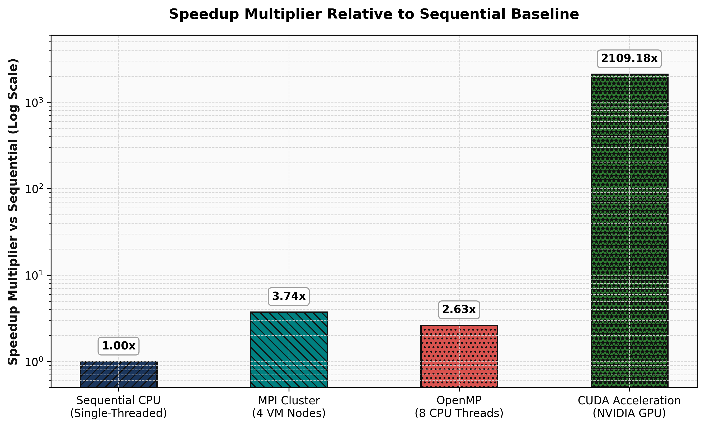
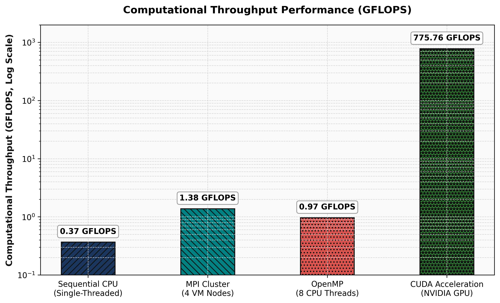

# Parallel & GPU Computing Lab: Matrix Multiplication Performance Analysis


This repository contains the source code, compilation instructions, execution commands, and comparative performance analysis for **4000 x 4000 Matrix Multiplication** ($C = A \times B$) evaluated across four core computing architectures:

1. **Sequential C:** Baseline single CPU core execution.
2. **OpenMP:** Shared-memory multithreading using 8 CPU threads.
3. **MPI:** Distributed-memory message passing across a 4-node Virtual Machine cluster.
4. **CUDA:** Massive data parallelism on an NVIDIA GPU.

---

## Comprehensive Performance Comparison

All paradigms process identical single-precision floating-point matrices ($N = 4000$). Correctness is verified across all models where $C[0][0] = 4000.00$.

| Computing Model | Configuration / Hardware | Execution Time (s) | Speedup vs. Baseline | Throughput (GFLOPS) | Verification ($C[0][0]$) | Data Source |
| :--- | :--- | :--- | :--- | :--- | :--- | :--- |
| **Sequential** | 1 CPU Core | **348.023990 s** | **1.00×** | 0.37 GFLOPS | 4000.00 | Measured Data |
| **OpenMP** | 8 CPU Threads | **132.457362 s** | **2.63×** | 0.97 GFLOPS | 4000.00 | Measured Data |
| **MPI** | 4 Processes / 4 VMs | **92.979510 s** | **3.74×** | 1.38 GFLOPS | 4000.00 | Measured Data |
| **CUDA** | NVIDIA RTX GPU | **0.165004 s** | **2109.18×** | 775.74 GFLOPS | 4000.00 | Measured Data |

---

## Performance Visualizations

### 1. Execution Time Comparison (Log Scale)


### 2. Relative Speedup Multiplier vs. Baseline


### 3. Computational Throughput (GFLOPS)


### 4. Scalability Across Matrix Dimensions ($N \times N$)


### 5. Combined Performance Overview


---

## Source Code & Execution Commands

### Part A: Sequential Matrix Multiplication
* **Source Code:** [`src/sequential/matrix_sequential.c`](./src/sequential/matrix_sequential.c)
* **Terminal Commands:**
  ```bash
  # Compile with O2 Optimization
  gcc -O2 src/sequential/matrix_sequential.c -o matrix_sequential

  # Execute
  ./matrix_sequential

# Set Thread Allocation
export OMP_NUM_THREADS=8

# Compile with OpenMP Flags
gcc -O2 -fopenmp src/openmp/matrix_openmp.c -o matrix_openmp

# Execute
./matrix_openmp


# 1. Cluster Network Ping Verification
ping -c 4 192.168.148.129

# 2. Compile & Test Basic MPI Inter-Process Communication
mpicc -O2 src/mpi/mpi_send_recv.c -o mpi_send_recv
mpirun -np 2 ./mpi_send_recv

# 3. Compile & Execute Main Distributed Matrix Multiplication
mpicc -O2 src/mpi/matrix_mpi.c -o matrix_mpi
mpirun -np 4 ./matrix_mpi


# Compile CUDA Source via NVCC Compiler
nvcc -O2 src/cuda/matrix_cuda.cu -o matrix_cuda

# Execute on GPU
./matrix_cuda