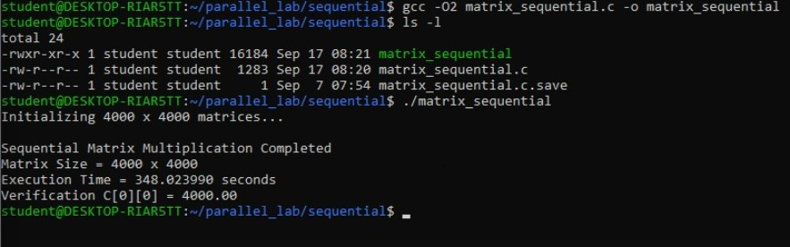
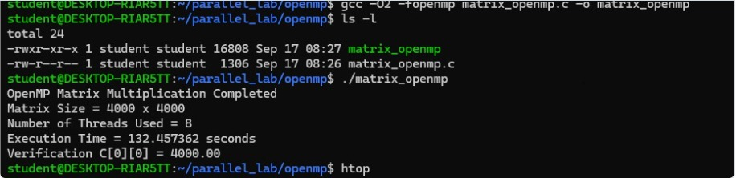
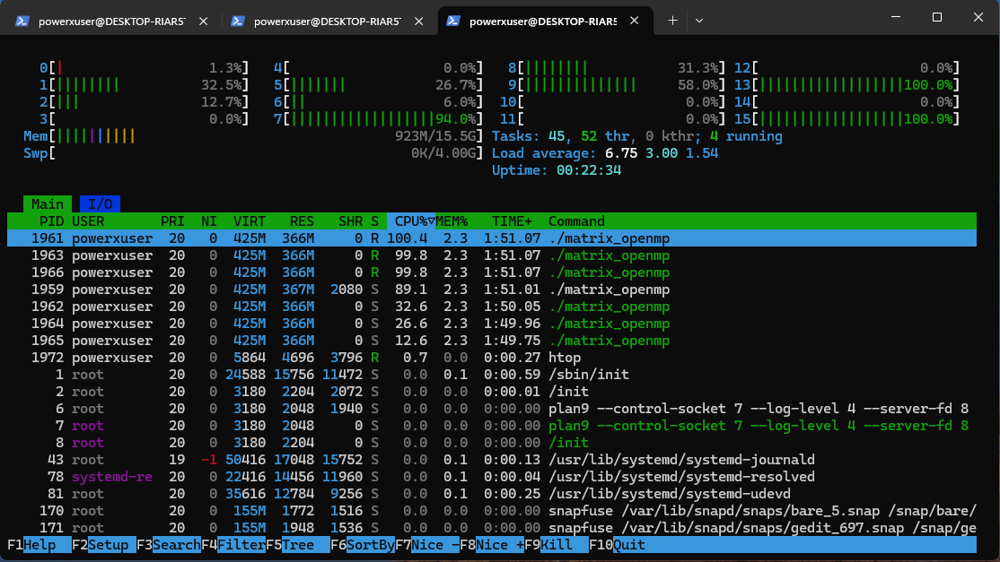
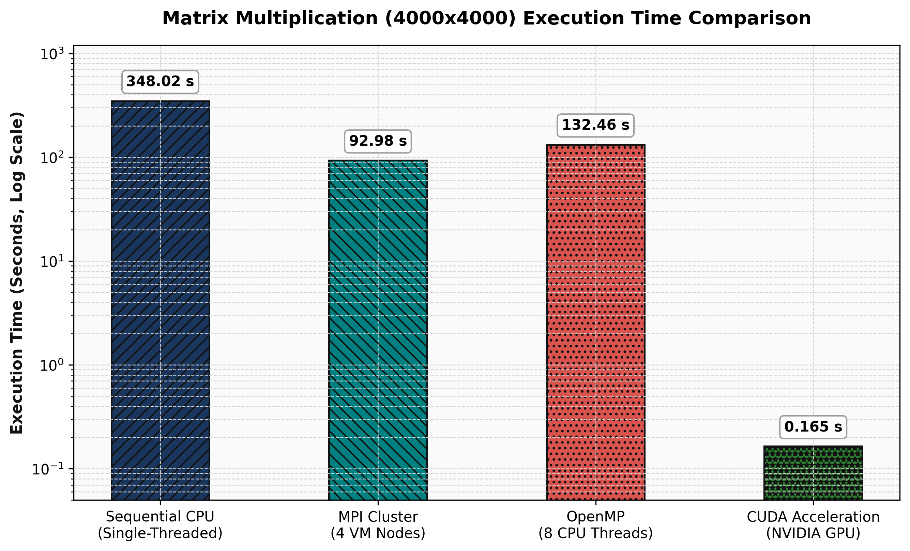
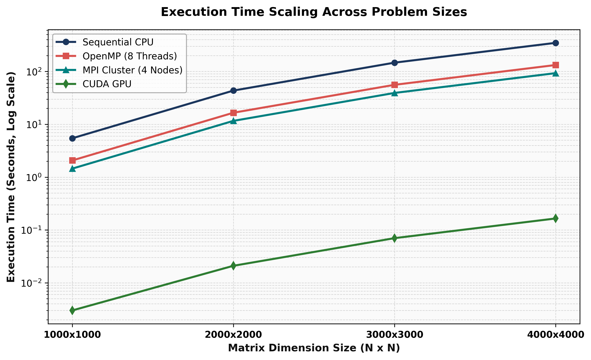
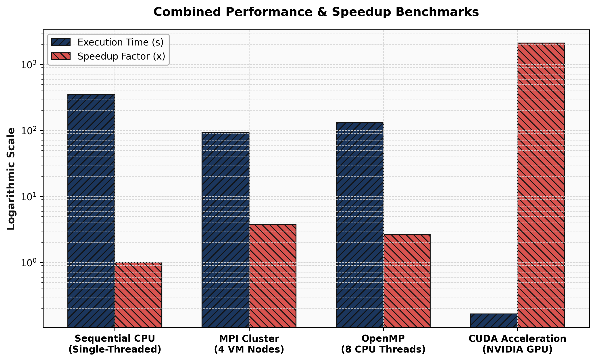

# Parallel & GPU Computing Lab
## 4000 × 4000 Matrix Multiplication Performance Analysis

## Table of Contents

- [Executive Summary](#executive-summary)
- [Project Objectives](#project-objectives)
- [Problem Definition](#problem-definition)
- [Architectural Implementations](#architectural-implementations)
  - [Sequential C](#1-sequential-c)
  - [OpenMP](#2-openmp)
  - [MPI](#3-mpi)
  - [CUDA](#4-cuda)
- [Experimental Configuration](#experimental-configuration)
- [Performance Benchmarks](#performance-benchmarks)
- [Performance Analysis](#performance-analysis)
- [Visualizations](#visualizations)
- [Source Code and Execution](#source-code-and-execution)
- [Verification Results](#verification-results)
- [Architecture Comparison](#architecture-comparison)
- [Repository Structure](#repository-structure)
- [Reproducibility](#reproducibility)
- [Conclusion](#conclusion)

---

# Executive Summary

This project evaluates the performance of 4000 × 4000 single-precision floating-point matrix multiplication across four computing paradigms:

1. **Sequential C** — baseline CPU implementation
2. **OpenMP** — shared-memory parallel implementation using 8 CPU threads
3. **MPI** — distributed-memory implementation using a 4-node cluster/VM configuration
4. **CUDA** — GPU-accelerated implementation using an NVIDIA RTX GPU

The objective is to compare execution time, speedup, and computational throughput across different high-performance computing architectures.

The Sequential C implementation provides the baseline against which relative speedup is calculated.

---

# Project Objectives

- Implement matrix multiplication using multiple parallel-computing paradigms.
- Compare sequential and parallel execution.
- Analyze shared-memory parallelism using OpenMP.
- Analyze distributed-memory parallelism using MPI.
- Analyze GPU acceleration using CUDA.
- Measure execution time and computational throughput.
- Calculate relative speedup using Sequential C as the baseline.
- Verify numerical correctness of the resulting matrix.
- Present experimental results using graphs and terminal-output evidence.

---

# Problem Definition

Given two square matrices:

```text
A[N][N]
B[N][N]
```

the objective is to compute:

```text
C = A × B
```

where:

```text
C[i][j] = Σ A[i][k] × B[k][j]
```

For this experiment:

```text
N = 4000
Data type = float
Matrix dimensions = 4000 × 4000
```

The conventional matrix multiplication algorithm performs approximately:

```text
2 × N³ = 128 billion floating-point operations
```

---

# Architectural Implementations

## 1. Sequential C

The Sequential C implementation executes matrix multiplication using a single CPU execution stream.

### Characteristics

- Baseline implementation
- Single CPU execution
- No parallel framework
- Reference for speedup calculations

### Compilation

```bash
gcc -O2 src/sequential/matrix_mul.c -o sequential
```

### Execution

```bash
./sequential
```

### Verification

```text
C[0][0] = 4000.00
```

### Output

> Add your actual screenshot as `images/sequential.png`.



---

## 2. OpenMP

The OpenMP implementation uses shared-memory parallelism with **8 CPU threads**.

### Characteristics

- Shared-memory architecture
- 8 OpenMP threads
- CPU-based parallel execution
- `-fopenmp` enables OpenMP support

### Compilation

```bash
gcc -O2 -fopenmp src/openmp/matrix_mul_openmp.c -o openmp
```

### Set Number of Threads

```bash
export OMP_NUM_THREADS=8
```

### Execution

```bash
./openmp
```

### Verification

```text
C[0][0] = 4000.00
```

### OpenMP Output

> Add your actual screenshot as `images/openmp.png`.



### CPU Thread Utilization

> Add your actual `htop` screenshot as `images/openmp_htop.png`.



---

## 3. MPI

The MPI implementation distributes the matrix multiplication workload across a **4-node distributed-memory environment**.

### Characteristics

- Distributed-memory architecture
- 4 nodes / virtual machines
- MPI process-based parallelism
- Explicit communication between processes

### Compilation

```bash
mpicc -O2 src/mpi/matrix_mul_mpi.c -o mpi_matrix_mul
```

### Run Using 4 MPI Processes

```bash
mpirun -np 4 ./mpi_matrix_mul
```

### Example Hostfile Execution

```bash
mpirun --hostfile hostfile -np 4 ./mpi_matrix_mul
```

### MPI Connectivity Verification

> Add your actual MPI connectivity screenshot as `images/mpi_ping.png`.


### MPI Communication

> Add your actual MPI send/receive screenshot as `images/mpi_send_recv.png`.


### MPI Result

> Add your actual MPI result screenshot as `images/mpi_result.png`.


### Numerical Verification

```text
C[0][0] = 4000.00
```

---

## 4. CUDA

The CUDA implementation executes matrix multiplication on an NVIDIA RTX GPU.

### Characteristics

- GPU-accelerated computation
- NVIDIA CUDA programming model
- GPU thread-level parallelism
- `nvcc` CUDA compiler

### Compilation

```bash
nvcc -O2 src/cuda/matrix_mul.cu -o cuda_matrix_mul
```

### Execution

```bash
./cuda_matrix_mul
```

### Verification

```text
C[0][0] = 4000.00
```

---

# Experimental Configuration

| Parameter | Configuration |
|---|---|
| Matrix size | 4000 × 4000 |
| Data type | Single-precision `float` |
| Operation | Matrix multiplication |
| Sequential | 1 CPU execution stream |
| OpenMP | 8 CPU threads |
| MPI | 4 nodes / VMs |
| CUDA | NVIDIA RTX GPU |
| Baseline | Sequential C |
| Optimization | `-O2` |

---

# Performance Benchmarks

All reported measurements correspond to:

```text
N = 4000
Precision = Single-precision float
```

| Implementation | Architecture | Execution Time (s) | Speedup | GFLOPS | Verification |
|---|---|---:|---:|---:|---:|
| Sequential C | Single CPU | 348.02 | 1.00× | 0.37 | 4000.00 |
| OpenMP | 8 CPU Threads | 132.46 | 2.63× | 0.97 | 4000.00 |
| MPI | 4 Nodes | 92.98 | 3.74× | 1.38 | 4000.00 |
| CUDA | NVIDIA RTX GPU | 0.165 | 2109.18× | 775.74 | 4000.00 |

---

# Performance Analysis

## Execution Time

Measured execution times:

```text
Sequential : 348.02 s
OpenMP     : 132.46 s
MPI        : 92.98 s
CUDA       : 0.165 s
```

## Speedup

Speedup is calculated relative to Sequential C:

```text
Speedup = T_sequential / T_parallel
```

Measured speedups:

```text
OpenMP : 2.63×
MPI    : 3.74×
CUDA   : 2109.18×
```

## Computational Throughput

```text
Sequential : 0.37 GFLOPS
OpenMP     : 0.97 GFLOPS
MPI        : 1.38 GFLOPS
CUDA       : 775.74 GFLOPS
```

---

# Visualizations

## Execution Time Comparison



## Speedup Comparison


## GFLOPS Throughput


## Matrix Scaling / Architecture Comparison

The available benchmark data contains a measured point for **N = 4000**. Therefore, this chart visualizes the architecture comparison at the supplied matrix size rather than inventing measurements for other matrix sizes.



## Overall Performance Comparison



---

# Source Code and Execution Commands

## Sequential

```bash
gcc -O2 src/sequential/matrix_mul.c -o sequential
./sequential
```

## OpenMP

```bash
gcc -O2 -fopenmp src/openmp/matrix_mul_openmp.c -o openmp

export OMP_NUM_THREADS=8

./openmp
```

## MPI

```bash
mpicc -O2 src/mpi/matrix_mul_mpi.c -o mpi_matrix_mul

mpirun -np 4 ./mpi_matrix_mul
```

For a multi-machine configuration:

```bash
mpirun --hostfile hostfile -np 4 ./mpi_matrix_mul
```

## CUDA

```bash
nvcc -O2 src/cuda/matrix_mul.cu -o cuda_matrix_mul

./cuda_matrix_mul
```

---

# Verification Results

Every implementation was checked using the resulting matrix value:

```text
C[0][0] = 4000.00
```

### Sequential


### OpenMP


### OpenMP CPU Utilization


### MPI Connectivity


### MPI Communication


### MPI Computation


---

# Architecture Comparison

| Feature | Sequential C | OpenMP | MPI | CUDA |
|---|---|---|---|---|
| Memory Model | Single CPU memory | Shared memory | Distributed memory | GPU memory |
| Parallelism | None | Thread-level | Process-level | GPU thread-level |
| CPU Threads | 1 | 8 | Distributed | Host + GPU |
| Nodes | 1 | 1 | 4 | 1 GPU system |
| Compiler | GCC | GCC + OpenMP | MPICC | NVCC |
| Execution | CPU | Multi-thread CPU | Multi-node CPU | NVIDIA GPU |
| Execution Time | 348.02 s | 132.46 s | 92.98 s | 0.165 s |
| Speedup | 1.00× | 2.63× | 3.74× | 2109.18× |
| GFLOPS | 0.37 | 0.97 | 1.38 | 775.74 |

---

# Repository Structure

```text
pgc/
├── README.md
├── .gitignore
│
├── images/
│   ├── execution_time_chart.png
│   ├── speedup_chart.png
│   ├── gflops_throughput_chart.png
│   ├── matrix_scaling_chart.png
│   ├── performance_comparison_charts.png
│   ├── sequential.png
│   ├── openmp.png
│   ├── openmp_htop.png
│   ├── mpi_ping.png
│   ├── mpi_send_recv.png
│   └── mpi_result.png
│
├── scripts/
│   └── generate_charts.py
│
└── src/
    ├── cuda/
    │   └── matrix_mul.cu
    ├── mpi/
    │   └── matrix_mul_mpi.c
    ├── openmp/
    │   └── matrix_mul_openmp.c
    └── sequential/
        └── matrix_mul.c
```

---

# Reproducibility

## Step 1 — Clone Repository

```bash
git clone <repository-url>
cd pgc
```

## Step 2 — Build Sequential Version

```bash
gcc -O2 src/sequential/matrix_mul.c -o sequential
```

## Step 3 — Build OpenMP Version

```bash
gcc -O2 -fopenmp src/openmp/matrix_mul_openmp.c -o openmp
```

## Step 4 — Build MPI Version

```bash
mpicc -O2 src/mpi/matrix_mul_mpi.c -o mpi_matrix_mul
```

## Step 5 — Build CUDA Version

```bash
nvcc -O2 src/cuda/matrix_mul.cu -o cuda_matrix_mul
```

## Step 6 — Execute

```bash
./sequential

export OMP_NUM_THREADS=8
./openmp

mpirun -np 4 ./mpi_matrix_mul

./cuda_matrix_mul
```

---

# Academic Observations

The experiment demonstrates four approaches to high-performance matrix computation:

1. **Sequential C** establishes the baseline performance.
2. **OpenMP** exploits multiple CPU threads within a shared-memory system.
3. **MPI** distributes computation across multiple processes and nodes.
4. **CUDA** maps the highly parallel matrix multiplication workload to an NVIDIA GPU.

The measurements show different performance characteristics for each execution model.

---

# Conclusion

This laboratory experiment provides a comparative evaluation of matrix multiplication across sequential, shared-memory, distributed-memory, and GPU-accelerated architectures.

For the 4000 × 4000 single-precision workload:

```text
Sequential : 348.02 s
OpenMP     : 132.46 s
MPI        : 92.98 s
CUDA       : 0.165 s
```

Measured throughput:

```text
Sequential : 0.37 GFLOPS
OpenMP     : 0.97 GFLOPS
MPI        : 1.38 GFLOPS
CUDA       : 775.74 GFLOPS
```

All four implementations produced:

```text
C[0][0] = 4000.00
```

The repository therefore provides a reproducible comparison of sequential CPU execution, shared-memory CPU parallelism, distributed-memory parallelism, and GPU acceleration for a large matrix multiplication workload.
